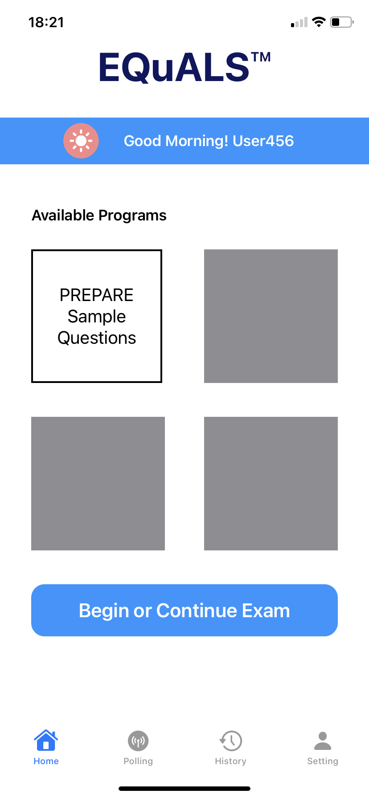
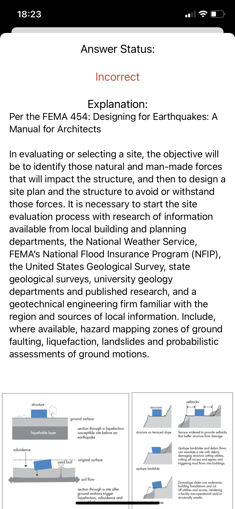
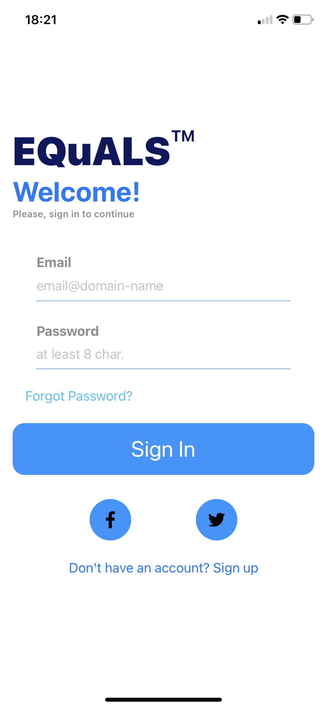
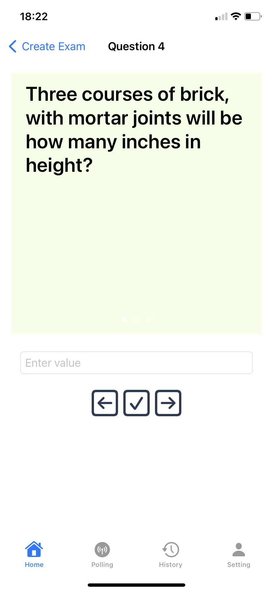
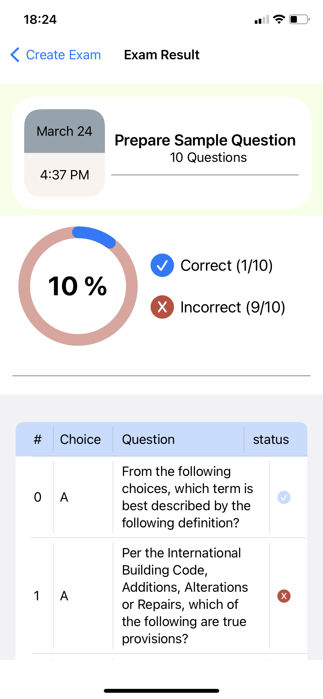

# QuestionP

## Our Goal

The goal of our project is to develop a mobile application of a web application call "EQuALS". 
We will make sure all the functionality the [web application](https://equals.prepareinc.us) have 
wil not be lose during the implementation. In addition, the overall UI/UX will be re-design to meet the mobile standard. 

## What we will learn

* Mobile app development
* Working knowledge of SWiftUI and XCode 
* UI/UX design for mobile application 
* Team-oriented development setting

## What we accomplish

* Build a UI page for question taking
* Implement algorithm in selecting multiple choice/ response question
* Implement page navigation function, include explanation page navigation
* Implement dynamic created result page after question taking is done

## What did not accomplish
* Connect to Azure database
* Payment method

## Project in-a-glare

https://www.youtube.com/watch?v=NBVYtkxW6Yg

 

>This is a capstone project for course ICSI 499: Capstone Project @ University at Albany.
